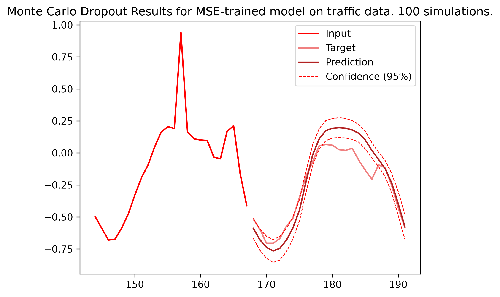
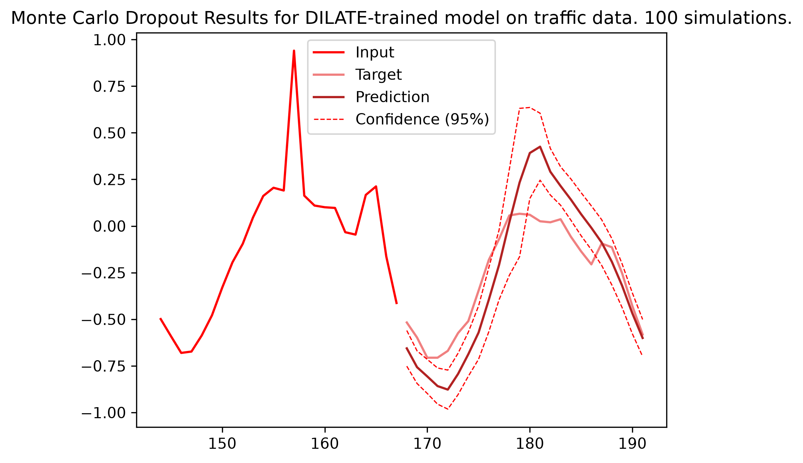

# Bayesian GRU Autoencoders for Time Series
## Credits & References
This project is based on the work of Vincent le Guen and Nicolas Thome on the DILATE loss function. Their code is published on the vincent-leguen/DILATE repository under GNU General Public License : The loss function and original GRU autoencoder architecture code belong to them. You can find their paper [here](https://arxiv.org/abs/1909.09020 "here").


## DILATE
In their 2019 NeurIPS Paper, they introduced a new loss function called DILATE, short for « DIstortion Loss based on shApe and TimE ». It’s  a sophisticated formula based on a simple, instinctive idea : To learn how to predict time series, could a deep model learn what the *shape* of the target should look like?
And there happens to be a function named DTW that computes not only a distance between two time series, but also on their respective shapes. However, it has two major flaws:


1. It is non-differentiable. To learn through the backpropagation, a deep model needs differentiability. So they hired a lookalike cousin of DTW, namely SoftDTW, that computes almost the same thing, but in a smooth, differentiable way.
2. Even for the comparison of two same-size sequences, SoftDTW can be sensitive to local (de)compression. This means that even if the shape is very well predicted, the spikes could be delayed in one way or the other. To penalize time shifts, they introduced a temporal distortion index (TDI).


The DILATE function is the sum of these two functions, weighted by a parameter $\alpha \in [0, 1]$ : <br>
$L_{DILATE} (y_{target}, y_{pred}) = \alpha\ SoftDTW_{\gamma}(y_{target}, y_{pred}) + (1-\alpha )\ TDI (y_{target}, y_{pred})$

The authored tested this loss function with a GRU Autoencoder (which was chosen for this demo) and a MLP. They compared it to the MSE loss function and found that "DILATE is comparable to the standard MSE loss when evaluated on MSE, and far better when evaluated on several shape and timing metrics."

Now in their conclusions, the authors mentioned the possibility of "[exploring] the extension of these ideas to probabilistic forecasting, for example by using bayesian deep learning [...] to compute the predictive distribution of trajectories". This is the "why" of this project : compare DILATE to MSE regarding their confidence.


## How to build a Bayesian GRU Autoencoder
In 2016, Gal & Ghahramani [showed](https://arxiv.org/abs/1512.05287 "showed") that contrary to popular belief, it was possible to use Dropout in RNNs for Variational Inference, only on both conditions that :
- Every weight in the model should be subverted to Dropout, including on the input level ;
- For RNNs on a GRU-basis, the masks generated to drop the "input-weights" and the "hidden-weights" must remain constant throughout all the input sequence.

In a univariate case, this means that a whole sequence of input sequence $(x_1, ..., x_t)$ could be zeroed out. To solve this, the FusionBayesianNetGRU class (see models/bayesian_fusion.py) has two encoding strategies.

1. "Pseudo-hot-encoding" transforms input sequence $(x_1, x_2, ..., x_t)$ into a diagonal matrix :

$$
\begin{pmatrix}
x_1 & 0 & ... & 0 \\
0 & x_2 & ... & 0 \\
... & ... & ... & ... \\
0 & 0 & ... & x_t
\end{pmatrix}
$$

It works, but quadratically multiplies the input size, hence an explosion of computing time. Not recommended.


2. "k-time-delay-embedding" with $k>=1$ transforms input sequence $(x_1, x_2, ..., x_t)$ into a sliding-window-matrix :

$$
\begin{pmatrix}
x_{k+1} & x_{k+2} & ... & x_t \\
... & ... & ... & ... \\
x_2 & x_3 & ... & x_{t-k+1} \\
x_1 & x_2 & ... & x_{t-k}
\end{pmatrix}
$$

It works, and only multiplies the input size by $\frac{(k+1)(t-k)}{t}$, which is much more interesting, especially when $k$ is small.

## How to Run the Demo

Please follow these steps sequentially to set up the project and run the demo:

1. **Clone the repository:**
   ```bash
   git clone https://github.com/yokotsuno12/Bayesian-GRU-Autoencoder-for-Time-Series
   cd Bayesian-GRU-Autoencoder-for-Time-Series
   ```

2. **Install the dependencies:**
   ```bash
   pip install tslearn
   pip install torch_timeseries
   pip install -r requirements.txt
   ```

3. **Run the demonstration script:**
   ```bash
   python demo.py
   ```

The models are pre-trained. If you want to re-train them, please change `num_epochs_mse` and/or `num_epochs_dil` at the beginning of the script. Note that the training time is very long.

During inference, the model executes $s=100$ forward passes with active variational dropout to sample the weight posterior, outputting both point predictions (reconstruction mean $\mu$) and continuous uncertainty bounds ($\pm 2\sigma$). The script will generate two plots showing the uncertainty of the MSE and DILATE trained models on the same input sample. 

<p middle="center">
  
  
</p>


A summary of the quantitative results is coming soon ! 
